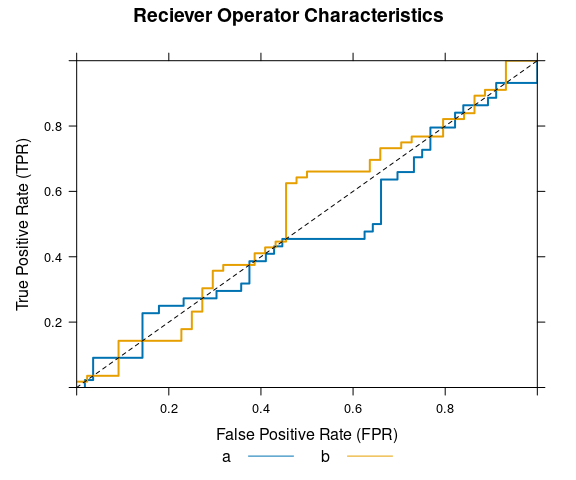
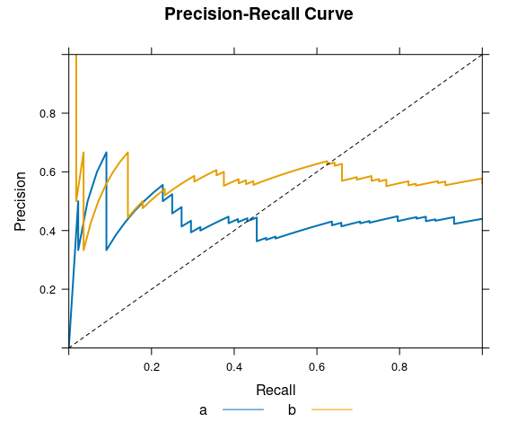

# Version 0.1-1

> Version 0.1-1 is considered pre-release of {SLmetrics}. We do not
> expect any breaking changes, unless a major bug/issue is reported and
> its nature forces breaking changes.

## General

  - **Backend changes:** All pair-wise metrics arer moved from {Rcpp} to
    C++, this have reduced execution time by half. All pair-wise metrics
    are now faster.

## Improvements

  - **NA-controls:** All pair-wise metrics that doesn’t have a
    `micro`-argument were handling missing values as according to C++
    and {Rcpp} internals. See
    [Issue](https://github.com/serkor1/SLmetrics/issues/8). Thank you
    @EmilHvitfeldt for pointing this out. This has now been fixed so
    functions uses an `na.rm`-argument to explicitly control for this.
    See below,

<!-- end list -->

``` r
# 1) define factors
actual    <- factor(c("no", "yes"))
predicted <- factor(c(NA, "no"))

# 2) accuracy with na.rm = TRUE
SLmetrics::accuracy(
    actual    = actual,
    predicted = predicted,
    na.rm     = TRUE
)
```

    #> [1] 0

``` r
# 2) accuracy with na.rm = FALSE
SLmetrics::accuracy(
    actual    = actual,
    predicted = predicted,
    na.rm     = FALSE
)
```

    #> [1] NaN

## Bug-fixes

  - The `plot.prROC()`- and `plot.ROC()`-functions now adds a line to
    the plot when `panels = FALSE`. See Issue
    <https://github.com/serkor1/SLmetrics/issues/9>.

<!-- end list -->

``` r
# 1) define actual
# classes
actual <- factor(
  sample(letters[1:2], size = 100, replace = TRUE)
)

# 2) define response
# probabilities
response <- runif(100)

# 3) calculate
# ROC and prROC

# 3.1) ROC
roc <- SLmetrics::ROC(
    actual,
    response
)

# 3.2) prROC
prroc <- SLmetrics::prROC(
    actual,
    response
)

# 4) plot with panels
# FALSE
par(mfrow = c(1,2))
plot(
  roc,
  panels = FALSE
)
```

<!-- -->

``` r
plot(
    prroc,
    panels = FALSE
)
```

<!-- -->

# Version 0.1-0

## General

  - {SLmetrics} is a collection of Machine Learning performance
    evaluation functions for supervised learning. Visit the online
    documentation on [GitHub
    Pages](https://serkor1.github.io/SLmetrics/).

## Examples

### Supervised classification metrics

``` r
# 1) actual classes
print(
    actual <- factor(
        sample(letters[1:3], size = 10, replace = TRUE)
    )
)
```

    #>  [1] a a a b c a b c c a
    #> Levels: a b c

``` r
# 2) predicted classes
print(
    predicted <- factor(
        sample(letters[1:3], size = 10, replace = TRUE)
    )
)
```

    #>  [1] c c b b a a b b c b
    #> Levels: a b c

``` r
# 1) calculate confusion
# matrix and summarise
# it
summary(
    confusion_matrix <- SLmetrics::cmatrix(
        actual    = actual,
        predicted = predicted
    )
)
```

    #> Confusion Matrix (3 x 3) 
    #> ================================================================================
    #>   a b c
    #> a 1 2 2
    #> b 0 2 0
    #> c 1 1 1
    #> ================================================================================
    #> Overall Statistics (micro average)
    #>  - Accuracy:          0.40
    #>  - Balanced Accuracy: 0.51
    #>  - Sensitivity:       0.40
    #>  - Specificity:       0.70
    #>  - Precision:         0.40

``` r
# 2) calculate false positive
# rate using micro average
SLmetrics::fpr(
    confusion_matrix
)
```

    #>         a         b         c 
    #> 0.2000000 0.3750000 0.2857143

### Supervised regression metrics

``` r
# 1) actual values
actual <- rnorm(n = 100)

# 2) predicted values
predicted <- actual + rnorm(n = 100)
```

``` r
# 1) calculate
# huber loss
SLmetrics::huberloss(
    actual    = actual,
    predicted = predicted
)
```

    #> [1] 0.4757045
