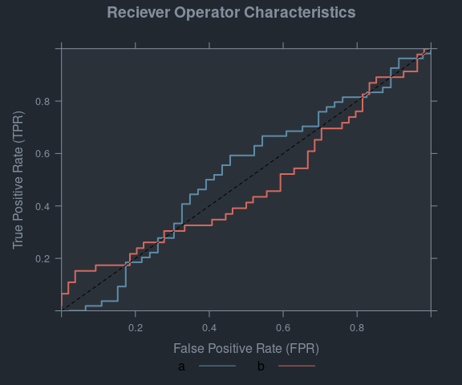
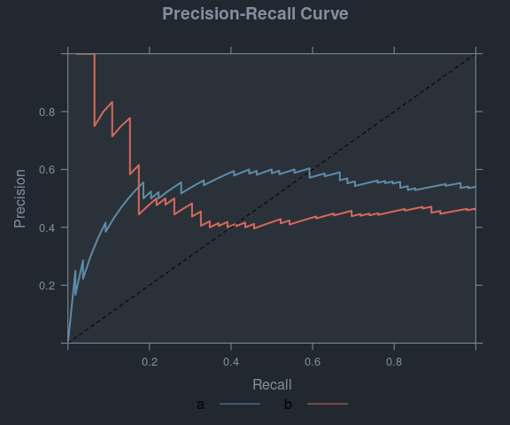

# Version 0.3-1

> Version 0.3-1 is considered pre-release of {SLmetrics}. We do not
> expect any breaking changes, unless a major bug/issue is reported and
> its nature forces breaking changes.

## :rocket: Improvements

- **OpenMP Support (PR
  <https://github.com/serkor1/SLmetrics/pull/40>):** {SLmetrics} now
  supports parallelization through OpenMP. The OpenMP can be utilized as
  follows:

``` r
# 1) probability distribution
# generator
rand.sum <- function(n){
    x <- sort(runif(n-1))
    c(x,1) - c(0,x)
  }

# 2) generate probability
# matrix
set.seed(1903)
pk <- t(replicate(100,rand.sum(1e3)))

# 3) Enable OpenMP
SLmetrics::setUseOpenMP(TRUE)
```

    #> OpenMP usage set to: enabled

``` r
system.time(SLmetrics::entropy(pk))
```

    #>    user  system elapsed 
    #>   0.001   0.001   0.001

``` r
# 3) Disable OpenMP
SLmetrics::setUseOpenMP(FALSE)
```

    #> OpenMP usage set to: disabled

``` r
system.time(SLmetrics::entropy(pk))
```

    #>    user  system elapsed 
    #>   0.002   0.000   0.002

## :bug: Bug-fixes

- **Plot-method in ROC and prROC
  (<https://github.com/serkor1/SLmetrics/issues/36>):** Fixed a bug in
  `plot.ROC()` and `plot.prROC()` where if `panels = FALSE` additional
  lines would be added to the plot.

# Version 0.3-0

## Improvements

## New Feature

- **Relative Root Mean Squared Error:** The function normalizes the Root
  Mean Squared Error by a facttor. There is no official way of
  normalizing it - and in {SLmetrics} the RMSE can be normalized using
  three options; mean-, range- and IQR-normalization. It can be used as
  follows,

``` r
# 1) define values
actual <- rnorm(1e3)
predicted <- actual + rnorm(1e3)

# 2) calculate Relative Root Mean Squared Error
cat(
  "Mean Relative Root Mean Squared Error", SLmetrics::rrmse(
    actual        = actual,
    predicted     = predicted,
    normalization = 0
  ),
  "Range Relative Root Mean Squared Error", SLmetrics::rrmse(
    actual        = actual,
    predicted     = predicted,
    normalization = 1
  ),
  "IQR Relative Root Mean Squared Error", SLmetrics::rrmse(
    actual        = actual,
    predicted     = predicted,
    normalization = 2
  ),
  sep = "\n"
)
```

    #> Mean Relative Root Mean Squared Error
    #> 40.74819
    #> Range Relative Root Mean Squared Error
    #> 0.1556036
    #> IQR Relative Root Mean Squared Error
    #> 0.738214

- **Log Loss:** Weighted and unweighted Log Loss, with and without
  normalization. The function can be used as follows,

``` r
# Create factors and response probabilities
actual   <- factor(c("Class A", "Class B", "Class A"))
weights  <- c(0.3,0.9,1) 
response <- matrix(cbind(
    0.2, 0.8,
    0.8, 0.2,
    0.7, 0.3
),nrow = 3, ncol = 2)

cat(
    "Unweighted Log Loss:",
    SLmetrics::logloss(
        actual,
        response
    ),
    "Weighted log Loss:",
    SLmetrics::weighted.logloss(
        actual   = actual,
        response = response,
        w        = weights
    ),
    sep = "\n"
)
```

    #> Unweighted Log Loss:
    #> 0.7297521
    #> Weighted log Loss:
    #> 0.4668102

- **Weighted Receiver Operator Characteristics:** `weighted.ROC()`, the
  function calculates the weighted True Positive and False Positive
  Rates for each threshold.

- **Weighted Precision-Recall Curve:** `weighted.prROC()`, the function
  calculates the weighted Recall and Precsion for each threshold.

## Breaking Changes

- **Weighted Confusion Matix:** The `w`-argument in `cmatrix()` has been
  removed in favor of the more verbose weighted confusion matrix call
  `weighted.cmatrix()`-function. See below,

Prior to version `0.3-0` the weighted confusion matrix were a part of
the `cmatrix()`-function and were called as follows,

``` r
SLmetrics::cmatrix(
    actual    = actual,
    predicted = predicted,
    w         = weights
)
```

This solution, although simple, were inconsistent with the remaining
implementation of weighted metrics in {SLmetrics}. To regain consistency
and simplicity the weighted confusion matrix are now retrieved as
follows,

``` r
# 1) define factors
actual    <- factor(sample(letters[1:3], 100, replace = TRUE))
predicted <- factor(sample(letters[1:3], 100, replace = TRUE))
weights   <- runif(length(actual))

# 2) without weights
SLmetrics::cmatrix(
    actual    = actual,
    predicted = predicted
)
```

    #>    a  b  c
    #> a 12 10 15
    #> b 10 15  8
    #> c  5 14 11

``` r
# 2) with weights
SLmetrics::weighted.cmatrix(
    actual    = actual,
    predicted = predicted,
    w         = weights
)
```

    #>          a        b        c
    #> a 3.846279 5.399945 7.226539
    #> b 4.988230 7.617554 4.784221
    #> c 2.959719 5.045980 4.725642

## :bug: Bug-fixes

- **Return named vectors:** The classification metrics when
  `micro == NULL` were not returning named vectors. This has been fixed.

# Version 0.2-0

## Improvements

- **documentation:** The documentation has gotten some extra love, and
  now all functions have their formulas embedded, the details section
  have been freed from a general description of \[factor\] creation.
  This will make room for future expansions on the various functions
  where more details are required.

- **weighted classification metrics:** The `cmatrix()`-function now
  accepts the argument `w` which is the sample weights; if passed the
  respective method will return the weighted metric. Below is an example
  using sample weights for the confusion matrix,

``` r
# 1) define factors
actual    <- factor(sample(letters[1:3], 100, replace = TRUE))
predicted <- factor(sample(letters[1:3], 100, replace = TRUE))
weights   <- runif(length(actual))

# 2) without weights
SLmetrics::cmatrix(
    actual    = actual,
    predicted = predicted
)
```

    #>    a  b  c
    #> a 14  9 14
    #> b 12 15 10
    #> c  6  9 11

``` r
# 2) with weights
SLmetrics::weighted.cmatrix(
    actual    = actual,
    predicted = predicted,
    w         = weights
)
```

    #>          a        b        c
    #> a 6.197341 4.717194 6.122321
    #> b 6.244226 7.511618 5.114025
    #> c 2.417569 5.487810 5.760531

Calculating weighted metrics manually or by using
`foo.cmatrix()`-method,

``` r
# 1) weigthed confusion matrix
# and weighted accuray
confusion_matrix <- SLmetrics::cmatrix(
    actual    = actual,
    predicted = predicted,
    w         = weights
)

# 2) pass into accuracy
# function
SLmetrics::accuracy(
    confusion_matrix
)
```

    #> [1] 0.4

``` r
# 3) calculate the weighted
# accuracy manually
SLmetrics::weighted.accuracy(
    actual    = actual,
    predicted = predicted,
    w         = weights
)
```

    #> [1] 0.3927467

Please note, however, that it is not possible to pass `cmatix()`-into
`weighted.accurracy()`,

- **Unit-testing:** All functions are now being tested for edge-cases in
  balanced and imbalanced classifcation problems, and regression
  problems, individually. This will enable a more robust development
  process and prevent avoidable bugs.

``` r
try(
    SLmetrics::weighted.accuracy(
        confusion_matrix
    )
)
```

    #> Error in UseMethod(generic = "weighted.accuracy", object = ..1) : 
    #>   no applicable method for 'weighted.accuracy' applied to an object of class "cmatrix"

## :bug: Bug-fixes

- **Floating precision:** Metrics would give different results based on
  the method used. This means that `foo.cmatrix()` and `foo.factor()`
  would produce different results (See Issue
  <https://github.com/serkor1/SLmetrics/issues/16>). This has been fixed
  by using higher precision `Rcpp::NumericMatrix` instead of
  `Rcpp::IntegerMatrix`.

- **Miscalculation of Confusion Matrix elements:** An error in how `FN`,
  `TN`, `FP` and `TP` were calculated have been fixed. No issue has been
  raised for this bug. This was not something that was caught by the
  unit-tests, as the total samples were too high to spot this error. It
  has, however, been fixed now. This means that all metrics that uses
  these explicitly are now stable, and produces the desired output.

- **Calculation Error in Fowlks Mallows Index:** A bug in the
  calculation of the `fmi()`-function has been fixed. The
  `fmi()`-function now correctly calculates the measure.

- **Calculation Error in Pinball Deviance and Concordance Correlation
  Coefficient:** See issue
  <https://github.com/serkor1/SLmetrics/issues/19>. Switched to unbiased
  variance calculation in `ccc()`-function. The `pinball()`-function
  were missing a weighted quantile function. The issue is now fixed.

- **Calculation Error in Balanced Accuracy:** See issue
  <https://github.com/serkor1/SLmetrics/issues/24>. The function now
  correctly adjusts for random chance, and the result matches that of
  {scikit-learn}

- **Calculation Error in F-beta Score:** See issue
  <https://github.com/serkor1/SLmetrics/issues/23>. The function werent
  respecting `na.rm` and `micro`, this has been fixed accordingly.

- **Calculation Error in Relative Absolute Error:** The function was
  incorrectly calculating means, instead of sums. This has been fixed.

## Breaking changes

- All regression metrics have had `na.rm`- and `w`-arguments removed.
  All weighted regression metrics have a seperate function on the
  `weighted.foo()` to increase consistency across all metrics. See
  example below,

``` r
# 1) define regression problem
actual    <- rnorm(n = 1e3)
predicted <- actual + rnorm(n = 1e3)
w         <- runif(n = 1e3)

# 2) unweighted metrics
SLmetrics::rmse(actual, predicted)
```

    #> [1] 0.9989386

``` r
# 3) weighted metrics
SLmetrics::weighted.rmse(actual, predicted, w = w)
```

    #> [1] 1.013139

- The `rrmse()`-function have been removed in favor of the
  `rrse()`-function. This function was incorrectly specified and
  described in the package.

# Version 0.1-1

## General

- **Backend changes:** All pair-wise metrics arer moved from {Rcpp} to
  C++, this have reduced execution time by half. All pair-wise metrics
  are now faster.

## Improvements

- **NA-controls:** All pair-wise metrics that doesn’t have a
  `micro`-argument were handling missing values as according to C++ and
  {Rcpp} internals. See
  [Issue](https://github.com/serkor1/SLmetrics/issues/8). Thank you
  @EmilHvitfeldt for pointing this out. This has now been fixed so
  functions uses an `na.rm`-argument to explicitly control for this. See
  below,

``` r
# 1) define factors
actual    <- factor(c("no", "yes"))
predicted <- factor(c(NA, "no"))

# 2) accuracy with na.rm = TRUE
SLmetrics::accuracy(
    actual    = actual,
    predicted = predicted,
    na.rm     = TRUE
)

# 2) accuracy with na.rm = FALSE
SLmetrics::accuracy(
    actual    = actual,
    predicted = predicted,
    na.rm     = FALSE
)
```

## :bug: Bug-fixes

- The `plot.prROC()`- and `plot.ROC()`-functions now adds a line to the
  plot when `panels = FALSE`. See Issue
  <https://github.com/serkor1/SLmetrics/issues/9>.

``` r
# 1) define actual
# classes
actual <- factor(
  sample(letters[1:2], size = 100, replace = TRUE)
)

# 2) define response
# probabilities
response <- runif(100)

# 3) calculate
# ROC and prROC

# 3.1) ROC
roc <- SLmetrics::ROC(
    actual,
    response
)

# 3.2) prROC
prroc <- SLmetrics::prROC(
    actual,
    response
)

# 4) plot with panels
# FALSE
par(mfrow = c(1,2))
plot(
  roc,
  panels = FALSE
)
```

<!-- -->

``` r
plot(
    prroc,
    panels = FALSE
)
```

<!-- -->

# Version 0.1-0

## General

- {SLmetrics} is a collection of Machine Learning performance evaluation
  functions for supervised learning. Visit the online documentation on
  [GitHub Pages](https://serkor1.github.io/SLmetrics/).

## Examples

### Supervised classification metrics

``` r
# 1) actual classes
print(
    actual <- factor(
        sample(letters[1:3], size = 10, replace = TRUE)
    )
)
```

    #>  [1] a b a c b a a a c b
    #> Levels: a b c

``` r
# 2) predicted classes
print(
    predicted <- factor(
        sample(letters[1:3], size = 10, replace = TRUE)
    )
)
```

    #>  [1] b a c c c c c c a a
    #> Levels: a b c

``` r
# 1) calculate confusion
# matrix and summarise
# it
summary(
    confusion_matrix <- SLmetrics::cmatrix(
        actual    = actual,
        predicted = predicted
    )
)
```

    #> Confusion Matrix (3 x 3) 
    #> ================================================================================
    #>   a b c
    #> a 0 1 4
    #> b 2 0 1
    #> c 1 0 1
    #> ================================================================================
    #> Overall Statistics (micro average)
    #>  - Accuracy:          0.10
    #>  - Balanced Accuracy: 0.17
    #>  - Sensitivity:       0.10
    #>  - Specificity:       0.55
    #>  - Precision:         0.10

``` r
# 2) calculate false positive
# rate using micro average
SLmetrics::fpr(
    confusion_matrix
)
```

    #>         a         b         c 
    #> 0.6000000 0.1428571 0.6250000

### Supervised regression metrics

``` r
# 1) actual values
actual <- rnorm(n = 100)

# 2) predicted values
predicted <- actual + rnorm(n = 100)
```

``` r
# 1) calculate
# huber loss
SLmetrics::huberloss(
    actual    = actual,
    predicted = predicted
)
```

    #> [1] 0.4389594
