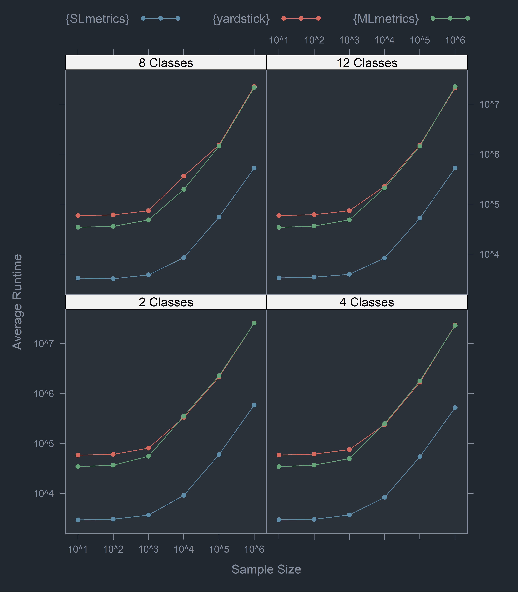
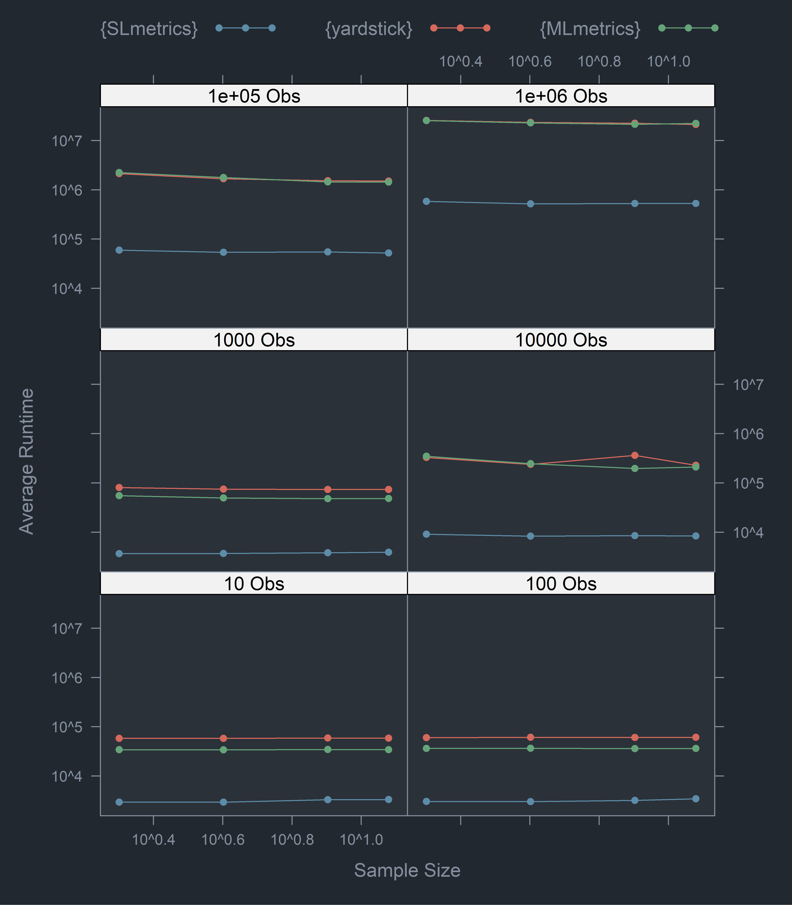

<!-- README.md is generated from README.Rmd. Please edit that file -->

# {SLmetrics}: Machine learning performance evaluation on steroids 

<!-- badges: start -->

[](https://CRAN.R-project.org/package=SLmetrics)
[](https://r-pkg.org/pkg/SLmetrics)
[](https://lifecycle.r-lib.org/articles/stages.html#experimental)
[](https://github.com/serkor1/SLmetrics/actions/workflows/R-CMD-check.yaml)
[](https://codecov.io/gh/serkor1/SLmetrics)
<!-- badges: end -->

{SLmetrics} is a collection of (lightning fast) performance evaluation
metrics for regression and classification models written in `C++` and
[{Rcpp}](https://github.com/RcppCore/Rcpp); it’s like using a
supercharged [{yardstick}](https://github.com/tidymodels/yardstick) to
measure model performance, without the risk of soft to super-hard
deprecations. {SLmetrics} provides (almost) the same array of metrics as
in [{scikit-learn}](https://github.com/scikit-learn/scikit-learn) but
without using [{reticulate}](https://github.com/rstudio/reticulate) and
the whole compile, run and debug cycle in python.

Depending on the mood and alignment of planets {SLmetrics} stands for
Supervised Learning metrics, or Statistical Learning metrics. If
{SLmetrics} catches on, the latter will be the core philosophy and
include unsupervised learning metrics. If not, then it will remain a
{pkg} for Supervised Learning metrics, and a sandbox for me to develop
my `C++` skills.

## :information_source: Why

Firstly, {SLmetrics} is *fast*. One, obviously, can’t build an R-package
on `C++` and [{Rcpp}](https://github.com/RcppCore/Rcpp) without a proper
pissing contest at the urinals; a detailed [blog
post](https://www.r-bloggers.com/) about the difference in speed has
been posted on [R-bloggers](https://www.r-bloggers.com/). For a quick
summary see below,

<details>
<summary>
Speed comparison
</summary>

Please refer to the performance-file in data-raw for the details about
the test. All y- and x-axis are logarithmically scaled by `log = TRUE`

## Runtime: Confusion Matrix

### By classes



### By sample size



## Runtime: RMSE


> \[!IMPORTANT\]
>
> In all fairness, {yardstick} is more defensive in its implementation
> of some of its functions. However, the difference in the average
> runtime can’t be entirely attributed to this element.

</details>

Secondly, {SLmetrics} is *simple* and *flexible* to use; it is based on
`S3` and provides the most essential classwise and aggregted metrics.

Thirdly, {SLmetrics} is *low level* and free of any
*{pkg}verse*-regimes; this provides the freedom to develop it further as
a part of your own {pkg}, or use it in any tidy, or untidy, pipeline you
would want to.

Fourthly, {SLmetrics} has a *larger* repertoire of supervised machine
learning metrics; all of which has been battle tested with
[{scikit-learn}](https://github.com/scikit-learn/scikit-learn) and
[{pytorch}](https://github.com/pytorch/pytorch) against
[{yardstick}](https://github.com/tidymodels/yardstick),
[{mlr3measures}](https://github.com/mlr-org/mlr3measures) and
[{MLmetrics}](https://github.com/yanyachen/MLmetrics).

## :information_source: Basic usage

In its most basic form the functions can be used as-is without any
pipelines, data.frames or recipes. Below are two simple usage examples.

### :books: Regression

Below is an example evaluating the in-sample performance of a linear
regression on `mpg` from the `mtcars` data set,

``` r
# 1) run regression
model <- lm(
  formula = mpg ~ .,
  data    = mtcars
)

# 2) evaluate RMSE
rmse(
  actual    = mtcars$mpg,
  predicted = fitted(model)
)
#> [1] 2.146905
```

### :books: Classification

Below is an example evaluating the in-sample performance of a logistic
regression on `Species` from the `iris` data set,

``` r
# 1) recode iris
# to binary problem
iris$Species <- factor(
  x = as.numeric(
    iris$Species == "virginica"
  ),
  levels = c(1,0),
  labels = c("virginica", "others")
)

# 2) fit the logistic
# regression
model <- glm(
  formula = Species ~ Sepal.Length + Sepal.Width,
  data    = iris,
  family = binomial(
    link = "logit"
  )
)

# 3) generate predicted
# classes
predicted <- as.factor(
  ifelse(
    predict(model, type = "response") > 0.5,
    yes = "virginica",
    no  = "others"
  )
)

# 4) generate
# confusion matrix
summary(
  confusion_matrix <-  cmatrix(
    actual    = iris$Species,
    predicted = predicted
  )
)
#> Confusion Matrix (2 x 2) 
#> ================================================================================
#>           virginica others
#> virginica        35     15
#> others           14     86
#> ================================================================================
#> Overall Statistics (micro average)
#>  - Accuracy:          0.81
#>  - Balanced Accuracy: 0.78
#>  - Sensitivity:       0.81
#>  - Specificity:       0.81
#>  - Precision:         0.81
```

<details>
<summary>
Class-wise and aggregated metrics
</summary>

**Classwise specificity**

``` r
sensitivity(
  confusion_matrix,
  micro = NULL
)
#> virginica    others 
#>      0.70      0.86
```

**Micro averaged specificity**

``` r
sensitivity(
  confusion_matrix,
  micro = TRUE
)
#> [1] 0.8066667
```

**Macro averaged specificity**

``` r
sensitivity(
  confusion_matrix,
  micro = FALSE
)
#> [1] 0.78
```

</details>

## :information_source: Installation

### :shield: Stable version

``` r
## install from github
devtools::install_github(
  repo = 'https://github.com/serkor1/SLmetrics',
  ref  = 'main'
)
```

### :hammer_and_wrench: Development version

``` r
## install from github
devtools::install_github(
  repo = 'https://github.com/serkor1/SLmetrics',
  ref  = 'development'
)
```

## :information_source: Code of Conduct

Please note that the {SLmetrics} project is released with a [Contributor
Code of
Conduct](https://contributor-covenant.org/version/2/1/CODE_OF_CONDUCT.html).
By contributing to this project, you agree to abide by its terms.
